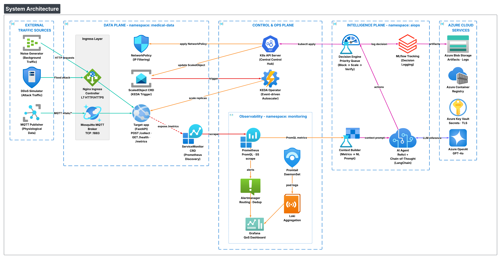
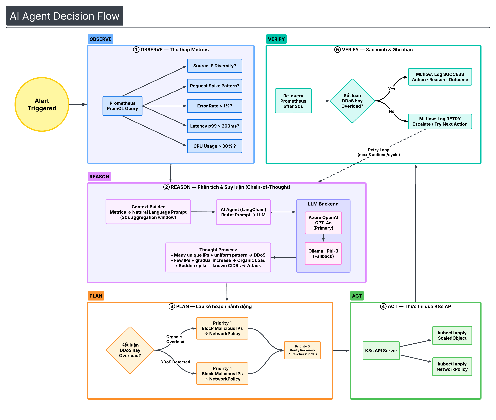

# NT114 — DevSecOps + MLOps for Agentic AIOps (QoS for Real-time IoMT)

**GVHD:** ThS. Lê Anh Tuấn

Đồ án chuyên ngành NT114 xây dựng nền tảng thực nghiệm **DevSecOps tích hợp MLOps** để vận hành **Agentic AIOps** nhằm đảm bảo
**QoS (latency < 200ms, error rate < 1%)** cho dữ liệu sinh hiệu thời gian thực (IoMT) trong điều kiện mạng biến động (noise traffic, load spike, DDoS).

## Project highlights

- **Microservices trên Kubernetes (AKS)** theo mô hình **3-plane**: Data / Intelligence / Control & Ops.
- **Simulators** tạo traffic **MQTT (critical)** và **HTTP (noise/DDoS)** để tái hiện sự cố.
- **AIOps agent (ReAct + CoT)** quan sát telemetry → suy luận (overload vs DDoS) → hành động (block/filter, autoscale) → verify.
- **DevSecOps + Observability**: CI/CD security gates, monitoring/logging, dashboard & alerting.

## Problem & goals

- Duy trì **p99 latency < 200ms** cho luồng dữ liệu sinh hiệu
- Giữ **error rate < 1%**
- Phân biệt **tải cao hợp lệ** vs **DDoS**, ưu tiên **Block IP/Filter trước → Scale sau → Verify**
- Giảm **MTTR** so với vận hành thủ công

## System architecture (3 planes)

### 1) Data Plane (`namespace: medical-data`)

- **Nginx Ingress Controller** (HTTP L7)
- **Mosquitto MQTT Broker** (:1883)
- **`target-app` (FastAPI)**: nhận HTTP traffic + subscribe MQTT, export metrics
- **NetworkPolicy** + **ScaledObject** (đối tượng để autoscale)

### 2) Intelligence Plane (`namespace: aiops`)

- **Prometheus + PromQL** (telemetry)
- **Context Builder** (metrics → ngữ cảnh text cho LLM)
- **AI Agent** (LangChain **ReAct + CoT**) + **Decision Engine**
- **MLflow Tracking** (log quyết định, theo dõi độ tin cậy)
- (Optional) **Local LLM** (Ollama/Phi-3) để so sánh trade-off

### 3) Control & Ops Plane

- **Kubernetes API Server** (mọi thao tác qua K8s API)
- **KEDA Operator** (event-driven autoscaling theo metrics)
- **Grafana**, **Alertmanager**, **Promtail + Loki**
- **GitHub Actions CI/CD** + **Trivy / SonarCloud** (security gates)

## Architecture diagrams

**Overall system (3-plane architecture)**



**AI Agent loop (ReAct)**



## Main flows

- **Critical (MQTT)**: Publisher → Mosquitto → `target-app` (MQTT subscribe)
- **Noise/DDoS (HTTP flood)**: Noise/DDoS → Ingress → `target-app` (FastAPI :8000)
- **AIOps loop**: Prometheus → Context Builder → Agent → K8s API → (NetworkPolicy / ScaledObject) → Verify

## Repository structure

```text
NT114/
├── .github/              # GitHub Actions workflows
├── docs/                 # Proposal, architecture diagrams, reports
├── helm-values/          # Helm values override (kube-prometheus-stack)
├── k8s/                  # Kubernetes manifests
├── terraform/            # IaC for AKS/ACR/networking
├── src/
│   ├── aiops-agent/      # Agent core (context, reasoning, actions)
│   ├── simulators/       # MQTT/HTTP load + noise + DDoS simulators
│   └── target-app/       # Target service (FastAPI, metrics, MQTT subscriber)
├── tests/                # Integration/E2E tests
├── .env.example          # Template env vars (NO real secrets)
├── .gitignore
└── README.md
```

## Prerequisites

- Python 3.9+
- Docker (Docker Desktop trên Windows)
- Kubernetes (Minikube/kind hoặc AKS)
- Terraform + Helm (nếu deploy lên K8s/Cloud)

## Quickstart (Local, Windows)

### 1) Environment variables

```bash
copy .env.example .env
```

Điền các giá trị thật vào `.env` (không commit).

### 2) Run target-app

```bash
python -m venv .venv
.venv\Scripts\activate
pip install -r src\target-app\requirements.txt
python src\target-app\app\main.py
```

### 3) Run simulators

```bash
.venv\Scripts\activate
pip install -r src\simulators\requirements.txt
python src\simulators\run_scenario.py
```

## Demo checklist (end-to-end)

1. Deploy monitoring stack (Prometheus/Grafana) trên Kubernetes.
2. Deploy `target-app` + Mosquitto MQTT + Ingress trong `medical-data`.
3. Verify Prometheus scrape OK (metrics của `target-app` và ingress có dữ liệu).
4. Run simulator: tạo tải hợp lệ + noise, sau đó bật kịch bản DDoS HTTP flood.
5. Quan sát dashboard (latency p99 / error rate) và alert (nếu bật).
6. Run AIOps agent trong `aiops`: observe → reason → plan → act.
7. Verify recovery: NetworkPolicy/ScaledObject được apply, QoS cải thiện (latency < 200ms mục tiêu).

## Deployment (Kubernetes / AKS)

### Monitoring stack (Helm)

```bash
helm repo add prometheus-community https://prometheus-community.github.io/helm-charts
helm repo update
helm install monitoring prometheus-community/kube-prometheus-stack -n monitoring --create-namespace -f helm-values/prometheus-stack-values.yaml
```

> Note: `helm-values/prometheus-stack-values.yaml` đang dùng password demo cho Grafana. Khi public/production hãy đổi password và quản lý bằng Secret.

### Terraform (AKS/ACR)

```bash
cd terraform
terraform init
terraform plan -var-file=environments/dev/terraform.tfvars
terraform apply -var-file=environments/dev/terraform.tfvars
```

## Experiments & evaluation

- Scenarios: overload vs DDoS, chaos events (pod failure)
- Metrics: latency p99, error rate, MTTR
- Compare: Cloud LLM baseline vs Local LLM (speed/cost/accuracy trade-offs)

## Project status (2026)

- **Feb**: hạ tầng cơ sở + simulators + base target-app + Mosquitto + Prometheus
- **Mar (current)**: phát triển lõi AI agent + KEDA/NetworkPolicy/RBAC + integration tests (detect → act → verify)
- **Apr**: DevSecOps pipeline + MLflow + dashboards + full observability
- **May**: stress/security tests, demo & report

## Security notes (IMPORTANT)

- Không commit `.env`, kubeconfig, keys/certs, tokens.
- Nếu bạn public repo: kiểm tra lại Helm values / manifests để tránh để mật khẩu demo hoặc thông tin nhạy cảm.

## Authors

| MSSV | Họ và tên | GitHub |
|---|---|---|
| 23521325 | Nguyễn Minh Quyền |  |
| 23521037 | Bùi Đặng Nhật Nguyên |  |
